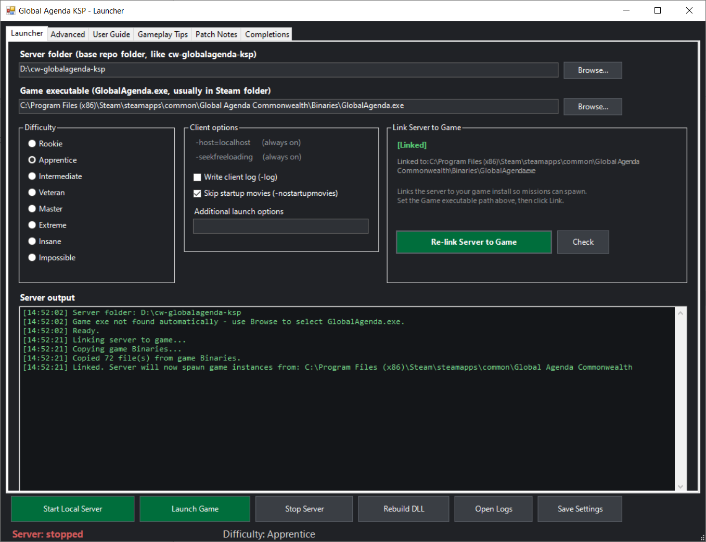
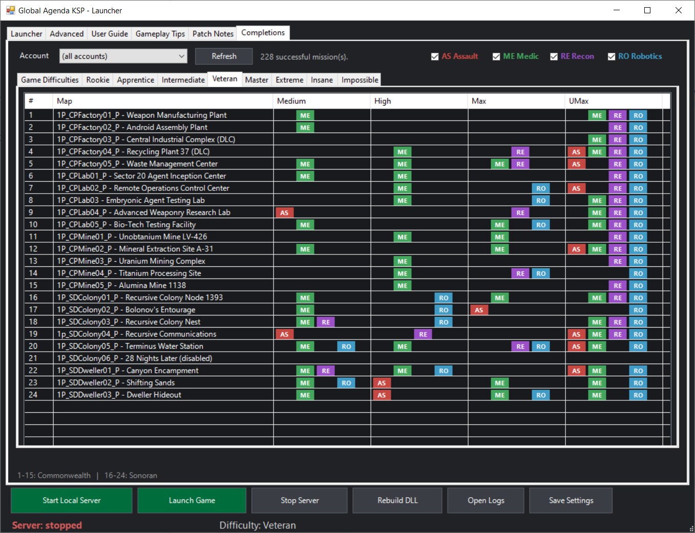
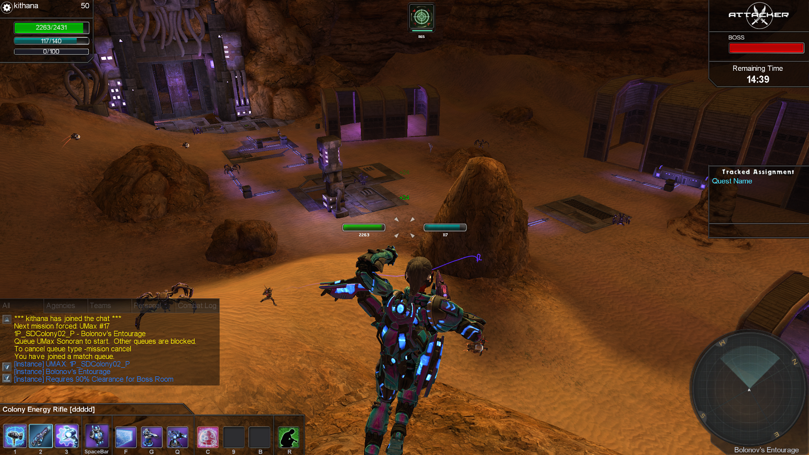

# CW Global Agenda KSP

A single player offline/local server for [Global Agenda](https://store.steampowered.com/app/17020/Global_Agenda_Free_Agent/), built on top of [commonwealth-ga-server](https://github.com/commonwealthga/commonwealth-ga-server).

Play over 20 unique PvE missions, at 4 different in-game difficulties (Medium, High, Max, UMax), with all 4 original classes.  With completion tracking, custom difficulty tiers for every skill level, boss room access gates, enemy tuning, and a launcher to manage everything.  This is a max level 50 build, for playing missions.  




https://youtu.be/TldkxBg9yWo

---

## Requirements

- Windows 10 or 11
- [Global Agenda Free Agent](https://store.steampowered.com/app/17020/Global_Agenda_Free_Agent/) installed
  > Note: the game does not appear in Steam Store searches — use the link above directly.
- PowerShell (included with Windows)

---

## Getting the Game Ready

If you do not have Global Agenda installed:

1. Install it via the Steam link above
2. Let the game install all its requirements
3. Launch the game once, it will reach a login screen. 
4. You can exit at that point.  The game is ready to be started from the KSP Launcher.

**Compatible game versions:**
- Base Global Agenda (fresh install from Steam)
- With DLC maps
- With the Commonwealth Client Patch (and or DLC)

All three work with KSP. If you want the DLC maps (Central Industrial Complex and Recycling Plant 37) and the Commonwealth Client Patch, the easiest way is to use the [Commonwealth Launcher](https://github.com/Zotikus1001/commonwealth-ga-launcher) to install them into your Global Agenda directory.  Their Client Patch does make the game run a bit smoother versus the Base.

---

## Quick Start

1. Download this repo as a ZIP and extract it to a folder of your choice (e.g. `D:\cw-globalagenda-ksp`)
2. Double-click **`Launcher-GlobalAgendaKSP.bat`**
3. Confirm the Server Folder is set to your repo folder (it should auto-fill)
4. Click **Browse** next to Game Executable and locate your `GlobalAgenda.exe`, typically at:
   ```
   C:\Program Files (x86)\Steam\steamapps\common\Global Agenda Live\Binaries\GlobalAgenda.exe
   ```
   or similar depending on your game version
5. Click **Link Server to Game** (this copies some files from the game folder to the server folder for it to run.  Game folder is unaffected)
6. Select a difficulty tier, see further below or in launcher for descriptions
7. Click **Start Local Server**
8. Click **Launch Game**
9. Log in with any name and password — your account is created automatically on first login, and will be required for future play

> You do not need a second copy of the game. One installation works for both online play via Commonwealth and offline local play via KSP. They will share keybinds, settings, and last login name. If you prefer them separated, you may use a second copy of the game.

> You also will encounter some UAC (User Account Control) for things like first launch of Global Agenda (tggame), the control-server, and when running the batch file for the launcher.  This is normal.  You may examine the code for any of these applications within this open project.  The code is present for a rebuild of the control-server, dinput8.dll, and version.dll should you wish to.  However these are provided already built in the \out folder for convenience.  Do not remove the server.db file, as it has numerous additions and changes making this game run properly.  It can be edited if you wish.  Normal operation is to leave these alone, let the launcher do the work.

---

## Difficulty Tiers

Select your difficulty in the launcher before starting the server. The tier applies a global HP and damage scalar to all enemies.

Do not start playing on Veteran or higher if this is your first time.  Be sure to equip your character with weapons, off-hands, armor, skills, and change your keybinds!

| Tier | Scalar | Description |
|------|--------|-------------|
| Rookie | 1.0x | For players unfamiliar with shooters |
| Apprentice | 1.35x | Good starting point for new players comfortable with games |
| Intermediate | 1.7x | For returning players testing the waters |
| Veteran | 2.0x | Skilled players looking for a challenge |
| Master | 2.2x | Very skilled veterans looking for a bigger challenge |
| Extreme | 2.5x | UMax may be doable by the most skilled players |
| Insane | 3.0x | UMax may be doable by the most skilled players |
| Impossible | 4.0x | Med/High likely doable — Max/UMax may be impossible |

Changing the tier stops the server. Click **Start Local Server** again to apply change and start server.

---

## Queueing Missions

Queue from inside the game: **MISSIONS (M) → SPECIAL OPS → TEAM → select difficulty (Medium, High, Max, or UMax) → Commonwealth or Sonoran**

This will queue a **RANDOM** mission from the choice pool: Commonwealth or Sonoran.

To queue a **SPECIFIC** mission instead of a random one, type one of the following in chat (mission difficulty and mission number): (Commonwealth is 1-15, Sonoran is 16-24, Refer to the Completions tab for mission numbers)

```
-mission med 20
-mission 20 high
-mi max 20
-mi 20 umax
```

Order of map number and difficulty does not matter. 

**You then must queue the mission yourself in the mission menu, but you are now guaranteed that mission**


To cancel a forced mission (as the queue will block you otherwise):
```
-mission cancel
-mi cancel
```

Medium: moderate density of low-level enemies, few elites

High: higher density of low-level enemies, some elites 

Max: some low-level enemies, moderate density of mid and high level elites

UMax: some low-level enemies, high density of mid and high level elites

---

## Troubleshooting

**Home map fails to load / stuck on loading screen / chat commands are not working**

The server uses fixed ports 9000 (TCP), 9001 (chat), and 9010 (IPC), and 9002-9020 (dynamic, game instance). If another application is using one of these ports the server may not function correctly. 

To check for conflicts (cmd or powershell):
```
netstat -ano | findstr ":90"
```

If you find a conflict, you can change the affected port in `out\control-server.json`. For example, change `"ipc_port": 9010` to `"ipc_port": 9030`.


**Getting disconnected after ~5 minutes in mission**

You likely have two KSP Launchers running, and they are conflicting.  Make sure you only have one running, Stop Server, and start server again.  


**I'm missing the .bat files and .ps1 files when extracting the zip, like Launcher-GlobalAgendaKSP.bat**

The .bat files and .ps1 file are being blocked by Windows.  Right click the zip file > General tab > Security: This file came...Unblock 

---

## Screenshots and YouTube



---

## Building from Source

Pre-built binaries are included in `out\`. If you want to build from source after making changes to the C++ code:

1. Install [MSYS2](https://www.msys2.org/)
2. Double-click `windows-server-menu.bat`
3. Choose option 1 — Build (required packages are installed automatically on first run)

---

## Credits

Built on [commonwealth-ga-server](https://github.com/commonwealthga/commonwealth-ga-server) by the Commonwealth GA team. All original server infrastructure, database schema, matchmaking, and game hook work is theirs. KSP adds solo/offline play support, difficulty tiers, enemy tuning, boss room access gates, and the KSP launcher.
